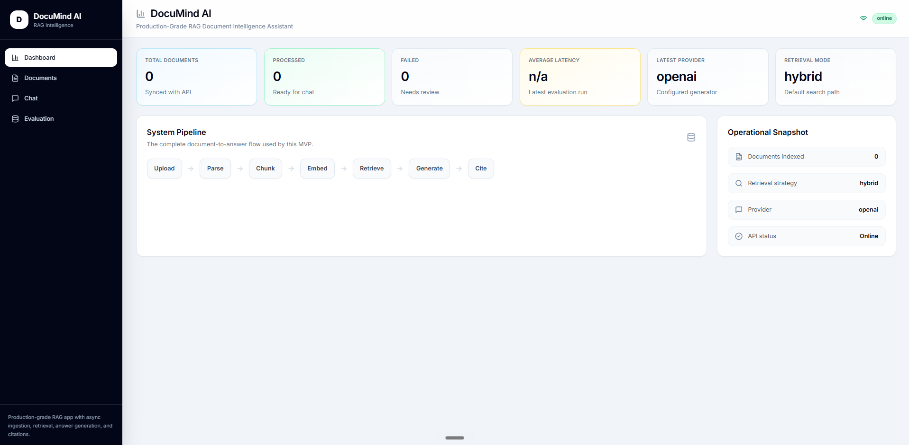
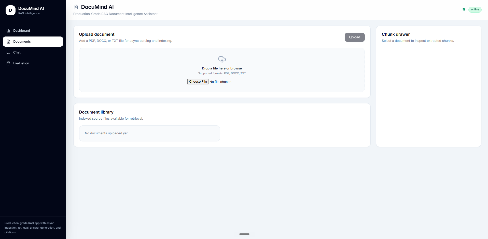
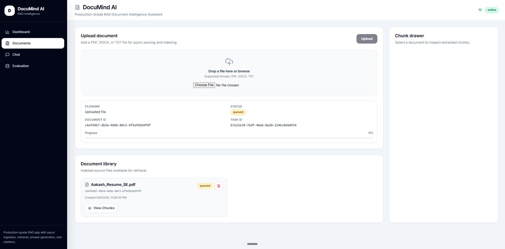
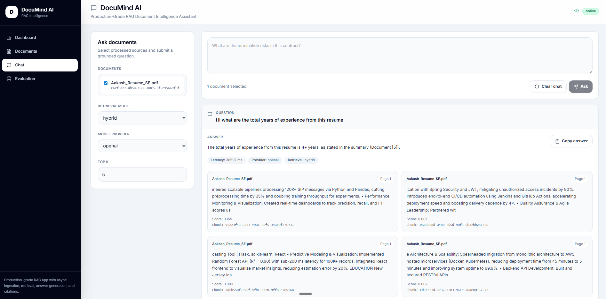
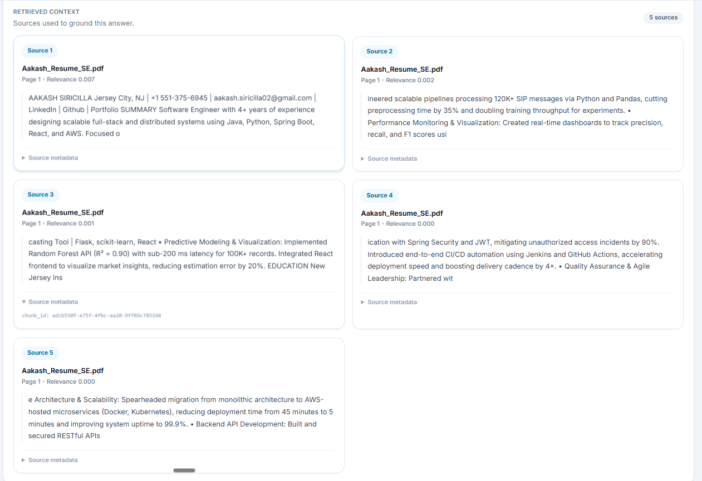
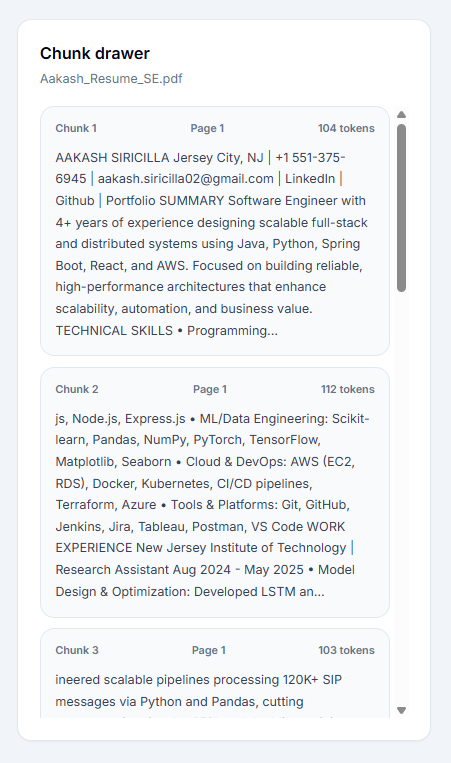
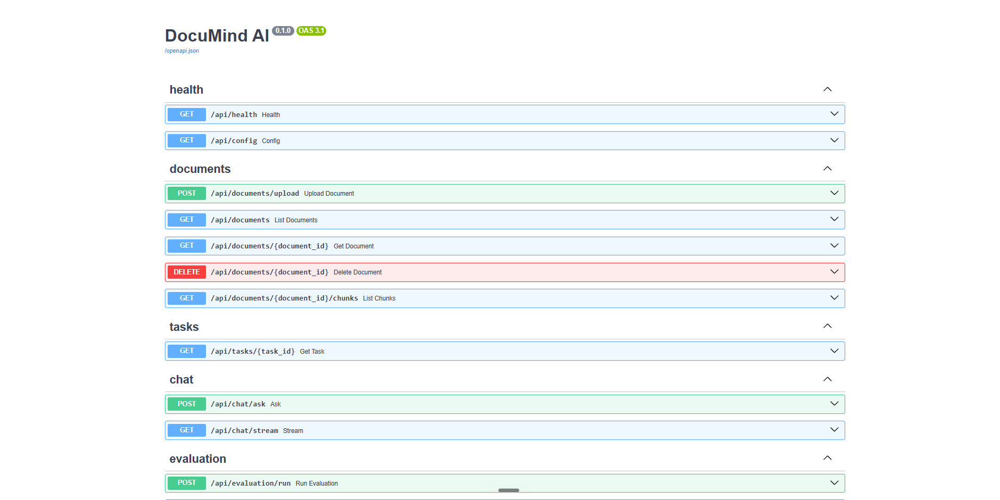
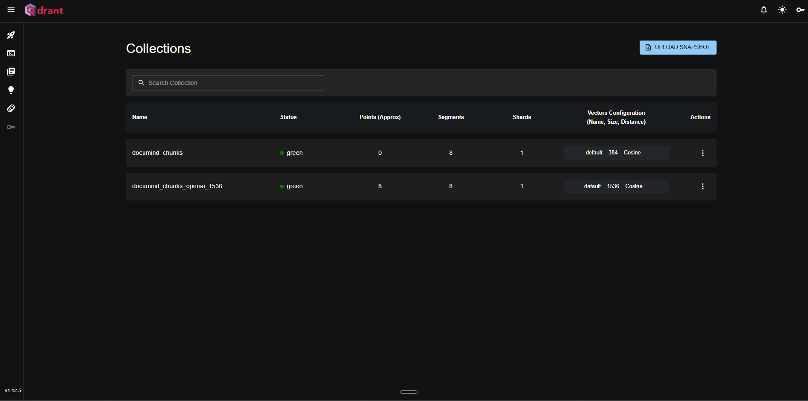
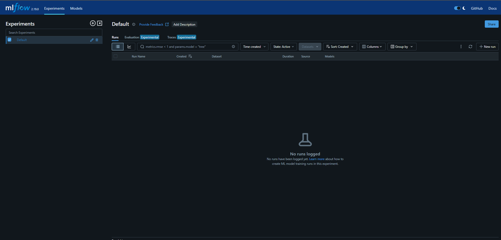

# DocuMind AI

**Production-Grade RAG Document Intelligence Assistant**


## Overview

DocuMind AI is a full-stack RAG document intelligence assistant for uploading PDF, DOCX, and TXT files, processing them asynchronously, and asking grounded questions over the indexed content. It combines a React/Vite app, FastAPI backend, Celery workers, Redis, PostgreSQL, Qdrant, and OpenAI-powered answer generation into a local Docker Compose workflow.

The application is designed around production-style document ingestion rather than a single synchronous chatbot request. Uploads return quickly, processing happens in the background, chunks and task metadata are persisted, vectors are stored in Qdrant, and answers are returned with citations so users can trace generated output back to source text.

The current end-to-end flow is: upload a PDF, process it with a Celery worker, chunk and index it, ask a question, receive a streamed answer, and inspect citation cards in the frontend.

## Why This Project

DocuMind AI is not just a PDF chatbot. It demonstrates the system design work needed to turn RAG into an application:

- Async ingestion with Celery workers and Redis.
- Production-style FastAPI architecture with Pydantic schemas.
- Vector search with Qdrant.
- Retrieval grounding with citation traceability.
- Streaming chat UX using POST-based SSE over `fetch`.
- Provider-aware vector indexing to avoid embedding dimension conflicts.
- Metadata persistence in PostgreSQL.
- Evaluation foundation with RAGAS and MLflow integration points.

## Key Features

- PDF/DOCX/TXT upload.
- Asynchronous document processing.
- Document and task status tracking.
- Chunk inspection drawer.
- Qdrant vector storage.
- Provider-aware vector collections.
- Hybrid retrieval foundation.
- OpenAI answer generation.
- Streaming chat responses.
- Citation-backed answers.
- Document deletion.
- Swagger API docs.
- Docker Compose local setup.
- MLflow/RAGAS evaluation foundation.

## Demo Workflow

```text
Upload document
  -> wait for async processing
  -> inspect chunks
  -> ask a question
  -> watch streamed answer
  -> review citation cards
```

## Screenshots

Screenshots should be captured from a local running Docker Compose stack. Placeholder paths are documented in [docs/screenshots.md](docs/screenshots.md).











## Architecture

DocuMind AI uses a React frontend, FastAPI API layer, Celery workers, Redis queue, PostgreSQL metadata database, Qdrant vector database, OpenAI generation, and MLflow/RAGAS evaluation foundation.

See [docs/architecture.md](docs/architecture.md) for architecture diagrams.

## System Design

| Component | Role |
| --- | --- |
| React frontend | Upload documents, inspect chunks, ask questions, display streamed answers and citations. |
| FastAPI API | Validates requests, exposes document/task/chat/evaluation endpoints, serves Swagger docs. |
| Celery worker | Processes uploaded documents asynchronously outside the request path. |
| Redis broker | Queues background document processing tasks. |
| PostgreSQL metadata DB | Stores document, chunk, task, chat, citation, and evaluation metadata. |
| Qdrant vector DB | Stores chunk embeddings for vector retrieval. |
| OpenAI generation | Produces grounded answers from retrieved context. |
| MLflow/RAGAS evaluation | Provides the foundation for tracking RAG quality experiments. |

## RAG Pipeline

1. Parse uploaded documents.
2. Chunk extracted text.
3. Embed chunks using the active embedding provider.
4. Index vectors in Qdrant.
5. Retrieve candidate chunks for a user question.
6. Assemble a grounded prompt from retrieved context.
7. Generate an answer.
8. Return citations for source traceability.

## Async Document Processing

Document upload returns immediately with a `document_id` and `task_id`. The actual parsing, chunking, embedding, Qdrant indexing, and status updates happen in a Celery worker. This keeps the API responsive for larger documents and gives the frontend a task-status workflow instead of blocking the upload request.

## Hybrid Retrieval

The project includes a retrieval layer designed to combine semantic vector search with keyword-based retrieval. Vector retrieval helps find semantically related chunks, while keyword retrieval helps with exact terms, acronyms, and domain-specific phrasing. The retrieved evidence is converted into citation cards for the user.

## Streaming Responses

`POST /api/chat/stream` returns a `text/event-stream` response while accepting a JSON request body. The frontend uses `fetch` and `ReadableStream` parsing instead of `EventSource`, which allows it to send selected document IDs, retrieval mode, model provider, and `top_k` in the request body.

The stream emits structured events:

- `metadata`
- `citation`
- `token`
- `done`
- `error`

## Provider-Aware Vector Indexing

Qdrant collections are separated by embedding provider and vector dimension:

- OpenAI embeddings use a 1536-dimensional collection such as `documind_chunks_openai_1536`.
- Local fallback embeddings use a 384-dimensional collection such as `documind_chunks_local_384`.

This prevents Qdrant vector dimension mismatch errors by avoiding writes of incompatible embeddings into the same collection.

## Tech Stack

| Area | Technology |
| --- | --- |
| Frontend | React, Vite, Tailwind CSS, Axios, fetch streaming |
| Backend | Python, FastAPI, Pydantic v2 |
| Worker | Celery |
| Database | PostgreSQL |
| Vector DB | Qdrant |
| Queue | Redis |
| LLM | OpenAI, Ollama/local fallback foundation |
| Evaluation | RAGAS, MLflow foundation |
| DevOps | Docker, Docker Compose |

## Folder Structure

```text
DocuMindAI/
├── backend/
│   ├── app/
│   │   ├── api/
│   │   ├── core/
│   │   ├── db/
│   │   ├── schemas/
│   │   ├── services/
│   │   └── worker/
│   ├── tests/
│   ├── Dockerfile
│   └── requirements.txt
├── frontend/
│   ├── src/
│   │   ├── api/
│   │   ├── components/
│   │   └── pages/
│   ├── Dockerfile
│   └── package.json
├── docs/
│   ├── architecture.md
│   ├── demo-script.md
│   ├── development.md
│   ├── screenshots.md
│   └── screenshots/
├── evaluation/
├── data/
├── docker-compose.yml
├── .env.example
└── README.md
```

## API Endpoints

| Method | Endpoint | Purpose |
| --- | --- | --- |
| GET | `/api/health` | Service health check. |
| GET | `/api/config` | Public runtime configuration summary. |
| POST | `/api/documents/upload` | Upload a PDF/DOCX/TXT file and queue processing. |
| GET | `/api/documents` | List uploaded documents. |
| GET | `/api/documents/{document_id}` | Fetch document metadata. |
| DELETE | `/api/documents/{document_id}` | Delete document metadata, chunks, and vectors. |
| GET | `/api/documents/{document_id}/chunks` | Inspect extracted chunks. |
| GET | `/api/tasks/{task_id}` | Check async processing status. |
| POST | `/api/chat/ask` | Non-streaming RAG answer with citations. |
| POST | `/api/chat/stream` | Streaming RAG answer with citations and metadata events. |
| POST | `/api/evaluation/run` | Create an evaluation run summary. |
| GET | `/api/evaluation/runs` | List evaluation run summaries. |

## Environment Variables

Use `.env.example` as the template for local configuration. It defines app settings, PostgreSQL, Redis/Celery, Qdrant, OpenAI, Ollama/local provider settings, retrieval settings, chunking settings, and MLflow/RAGAS settings.

Never commit a real `.env` file or API key.

## Local Setup

```bash
copy .env.example .env
docker compose up --build
```

For macOS/Linux:

```bash
cp .env.example .env
docker compose up --build
```

Open:

- Frontend: http://localhost:5173
- Swagger API docs: http://localhost:8000/docs
- Qdrant dashboard: http://localhost:6333/dashboard
- MLflow: http://localhost:5000

## Docker Setup

| Service | Port | Purpose |
| --- | --- | --- |
| Frontend | `5173` | React/Vite app. |
| Backend | `8000` | FastAPI API and Swagger docs. |
| Postgres | `5432` | Metadata database. |
| Redis | `6379` | Celery broker/result backend. |
| Qdrant | `6333/6334` | Vector database and dashboard. |
| MLflow | `5000` | Experiment tracking UI. |

## Testing

Backend syntax and unit tests:

```powershell
python -m compileall backend/app
$env:PYTHONPATH='backend'; python -m pytest backend/tests -q
```

Frontend build:

```bash
cd frontend
npm run build
cd ..
```

Docker Compose validation:

```bash
docker compose config --quiet
```

## Evaluation with RAGAS / MLflow

The project includes an evaluation foundation for RAGAS-style metrics and MLflow experiment tracking. The current implementation stores summarized evaluation runs and provides the structure for tracking faithfulness, answer relevancy, context precision, context recall, and latency.

No benchmark results are claimed in this repository unless generated from an actual run.

## Troubleshooting

| Issue | Resolution |
| --- | --- |
| Docker Desktop not running | Start Docker Desktop and rerun `docker compose up --build`. |
| OpenAI quota error | Check billing/quota, switch keys, or use local fallback behavior where supported. |
| Qdrant vector dimension mismatch | Use provider-aware collections such as `documind_chunks_openai_1536` and `documind_chunks_local_384`; reset Qdrant only when intentionally rebuilding indexes. |
| Celery unregistered task | Confirm worker logs show `app.worker.tasks.process_document` under `[tasks]`. |
| React blank page / `React is not defined` | Ensure JSX files import `React` when using the classic runtime and rerun `npm run build`. |
| API key missing | Set `OPENAI_API_KEY` in `.env`; never commit the real key. |
| Streaming fallback issues | Use `/api/chat/ask` from Swagger to verify non-streaming chat still works, then inspect backend logs for `/api/chat/stream`. |

## Future Improvements

- Cross-encoder reranking.
- OCR for scanned PDFs.
- Authentication and user-specific document isolation.
- Cloud deployment.
- Stronger evaluation dashboard.
- Multi-document comparison.
- Role-specific document modes.
