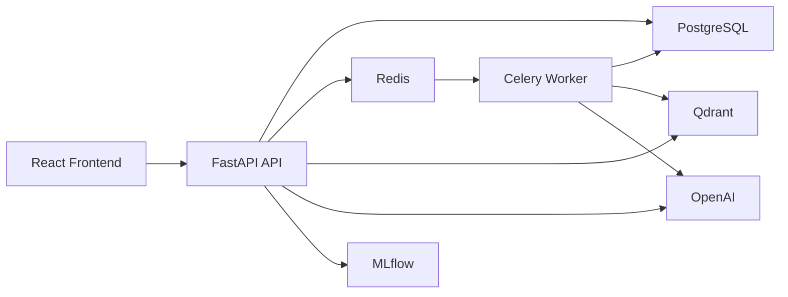
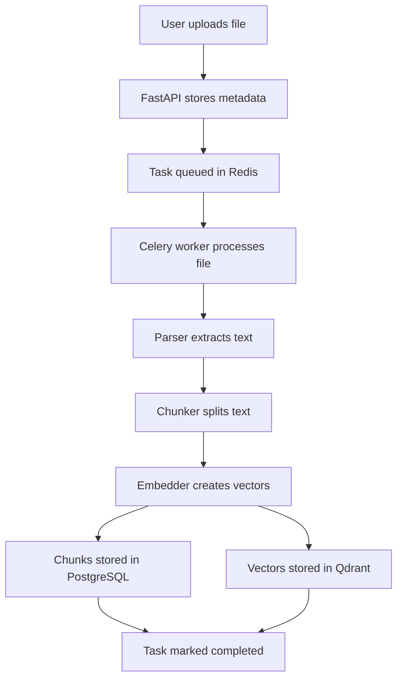
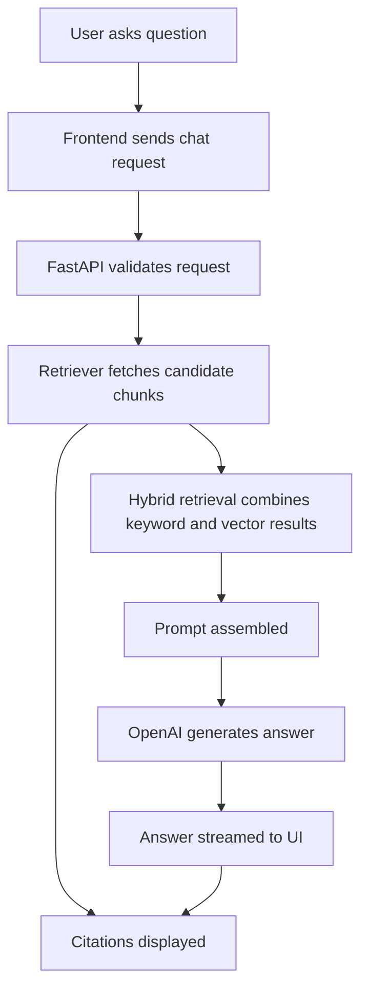
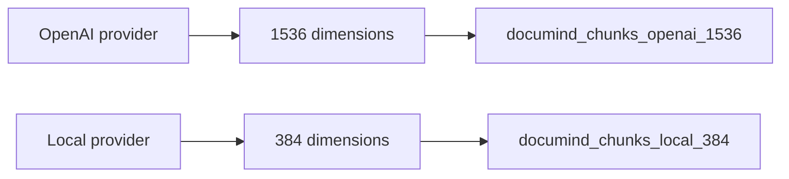

# Architecture

DocuMind AI is organized as a full-stack RAG system with a React frontend, FastAPI backend, asynchronous Celery workers, PostgreSQL metadata storage, Redis queueing, Qdrant vector indexing, OpenAI generation, and an MLflow/RAGAS evaluation foundation.

## High-Level System Architecture

## Document Ingestion Flow

## RAG Query Flow

## Provider-Aware Vector Collection Strategy

Qdrant collections have a fixed vector dimension. Mixing embeddings from different providers or models in a single collection can cause dimension mismatch errors. DocuMind AI avoids this by deriving collection names from the active provider and vector size, so OpenAI and local fallback embeddings are indexed separately.
